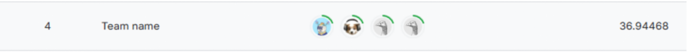
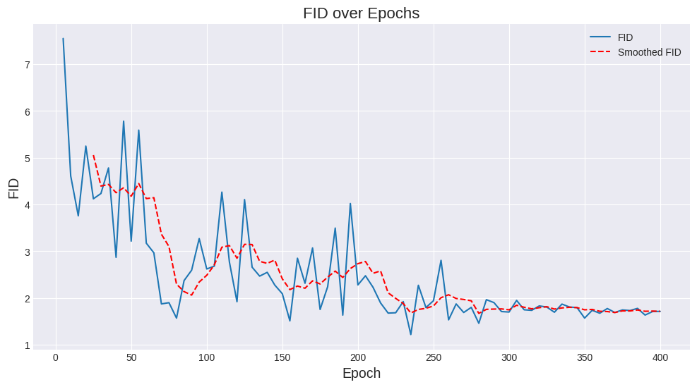
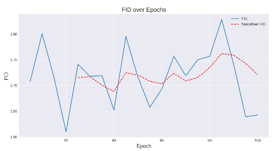
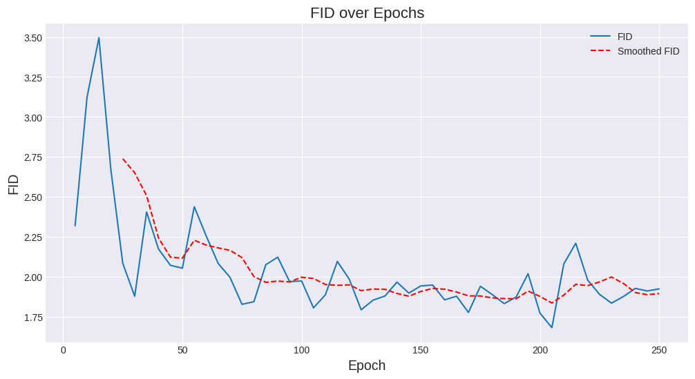

# 🎨 I'm Something of a Painter Myself — Monet Style Transfer
### Unified Implementation of CycleGAN · CUT · AttentionGAN

This repository contains a complete solution for the Kaggle competition  
**“I’m Something of a Painter Myself”**, which focuses on generating Monet-style
paintings from natural photos using *unpaired image-to-image translation*.

We reconstruct and unify three representative GAN models:

- **CycleGAN** (ICCV 2017)
- **CUT – Contrastive Unpaired Translation** (ECCV 2020)
- **AttentionGAN** (WACV 2021)

---

## 🏆 Competition Performance

Our team achieved a **final score of 36.94468** on the leaderboard, ranking:

# 🎉 **4th out of 170 teams (Top 2%)**

This reflects strong model performance and stability across multiple architectures.



> *(Score and ranking were recorded during project reporting; leaderboard may later change depending on competition timeline.)*

---

## 🤗 HuggingFace Model Release

Our best-performing CUT generator (Photo → Monet) has been fully open-sourced on HuggingFace:

[](https://huggingface.co/xiaoojs20/cut-monet-style-transfer)

---

## 🚀 Overview

The objective is to train models that generate 7,000–10,000 Monet-style images  
(256×256 RGB) for submission.

The dataset consists of:

- Monet paintings (`monet_jpg`, `monet_tfrec`)
- Natural photos (`photo_jpg`, `photo_tfrec`)

Evaluation uses **FID** and **MI-FID**, measuring the distance between the
distribution of generated images and real Monet images.

---

## 📂 Project Structure
```
painter/
├── data/                 # dataset placeholder; real data not included
├── imgs/                 # images for documentation (optional)
├── notebooks/            # Kaggle submission & analysis notebooks
├── src/
│   ├── models/           # unified CycleGAN / CUT / AttentionGAN models
│   ├── datasets/         # dataset loading utilities
│   ├── util/             # training utilities (logging, losses, etc.)
│   ├── train_cyclegan.py
│   ├── train_cut.py
│   ├── train_attngan.py
│   ├── test_cyclegan.py
│   ├── test_cut.py
│   └── test_attngan.py
├── README.md
└── README_zh.md
```
---

## 🧠 Models

### **1️⃣ CycleGAN**
CycleGAN performs unpaired translation using:

- Generator–Discriminator pairs  
- Cycle consistency loss  
- Least-squares GAN loss (LSGAN)

💡 *Observations during training*  
CycleGAN is sensitive to learning rate decay and requires batch size = 1,
consistent with official implementations.

---

### **2️⃣ CUT (Contrastive Unpaired Translation)**

CUT replaces cycle-consistency with **PatchNCE contrastive loss**, allowing
stronger content preservation.

Key advantages:

- Faster convergence  
- Better structure retention  
- Works well on style transfer tasks with strong texture changes  

---

### **3️⃣ AttentionGAN**

AttentionGAN enhances translation using:

- Spatial attention  
- Channel attention  
- Region-level style learning  

This often yields more aesthetically pleasing Monet strokes and textures.

---

## 📊 Results Summary

| Model         | Strengths                               | Weaknesses                          |
|---------------|------------------------------------------|--------------------------------------|
| **CycleGAN**  | Strong global style transfer             | Unstable training, sensitive to LR   |
| **CUT**       | Best content preservation                | Sometimes less stylized              |
| **AttentionGAN** | Finest local texture & color details | Training more computationally heavy  |

Final generated images demonstrate that all three methods can produce Monet-style transformations with different emphases on texture, structure, and artistic abstraction.

---

## 🎯 CUT Training Analysis

To further optimize performance, we explored **four different training strategies**
for CUT. The corresponding FID scores and training curves are summarized below:

| Training Strategy         | FID Score |
|---------------------------|-----------|
| Standard Training         | ~1.8      |
| **Best-Restart**          | ~1.6 (Best) |
| High-Epoch Pretraining    | ~4.0      |
| Monet-Finetune            | ~1.8      |

Below are the training curves for each strategy:

### 📌 Standard Training

<!--  -->
<p align="center">
  
</p>

### ⭐ Best-Restart (Best Performing Strategy)
This strategy restarts training from the best-performing checkpoint and leads to
the lowest FID (~1.6), showing improved stability and convergence.

<!--  -->
<p align="center">
  
</p>

### 🔁 High-Epoch Pretraining
Pretraining for many epochs before fine-tuning leads to weaker results (~4.0),
indicating potential overfitting or style drift.

<!--  -->
<p align="center">
  
</p>

### 🎨 Monet-Finetune
Fine-tuning specifically on Monet paintings restores performance to ~1.8 and improves style fidelity.

<!--  -->
<p align="center">
  
</p>


These results highlight the importance of checkpoint selection and staged
training when using CUT for artistic style transfer tasks.

---

## 🛠️ How to Train

### **CycleGAN**
```bash
python src/train_cyclegan.py
```
### **CUT**
```bash
python src/train_cut.py
```
### **AttentionGAN**
```bash
python src/train_attngan.py
```

### 📌 Notes  
- The training shell scripts under `scripts/` serve as usage examples for all
  models.  
- Real datasets and checkpoints are **excluded** due to storage limitations.  
---

🙏 Acknowledgements

This project builds on the outstanding work of these open-source implementations:
- CycleGAN – Zhu et al., ICCV 2017
https://github.com/junyanz/pytorch-CycleGAN-and-pix2pix
- CUT – Park et al., ECCV 2020
https://github.com/taesungp/contrastive-unpaired-translation
- AttentionGAN – Tang et al., WACV 2021
https://github.com/Ha0Tang/AttentionGAN